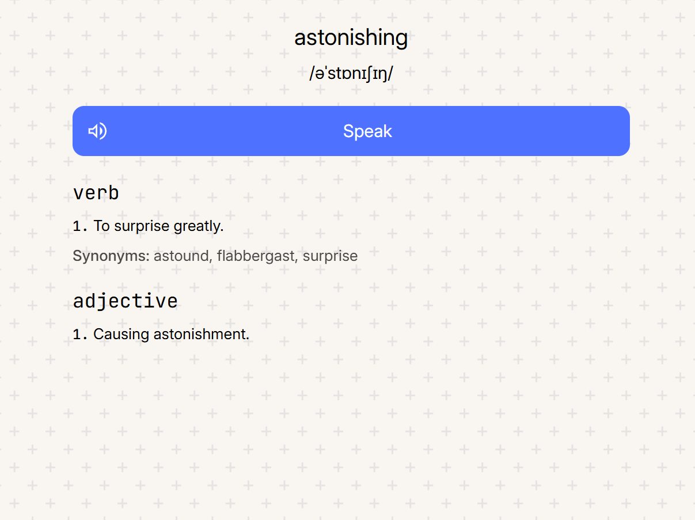

# 📘 Newvocab

Learn a new word to expand your vocab!

    

## Search a specific word

Include `?word=<word>` at the end of the URL. For example:

https://axorax.github.io/newvocab?word=hello

---

    <a href="https://github.com/Axorax/socials">Socials + Donate</a>

